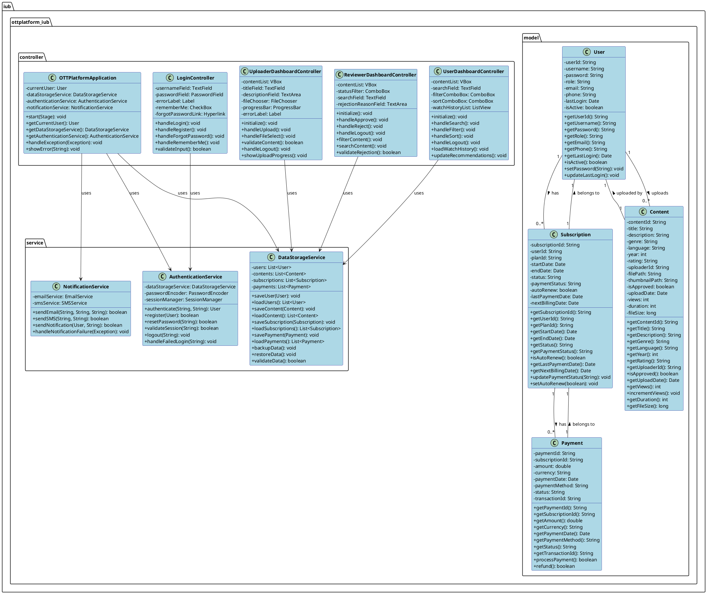
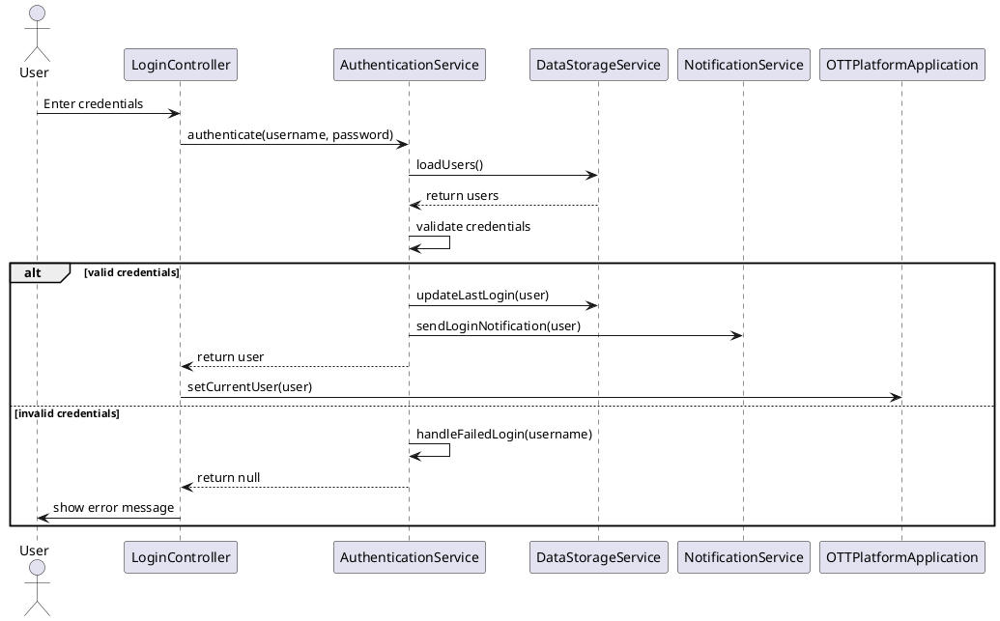
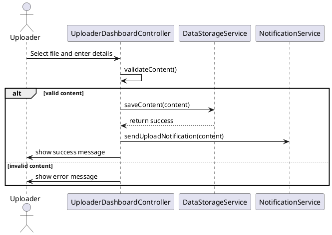
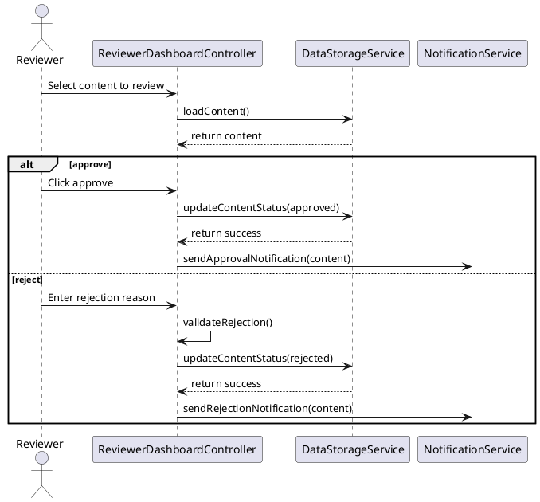

# OTT Platform - UML Documentation Report

## 1. System Overview

The OTT Platform is a comprehensive media streaming solution with multiple user roles and complex interactions. This document provides detailed UML diagrams and explanations of the system architecture.

## 2. Class Diagram

## 3. Sequence Diagrams

### 3.1 User Authentication Flow

### 3.2 Content Upload Flow

### 3.3 Content Review Flow

## 4. Edge Cases and Error Handling

### 4.1 Authentication Edge Cases

- Multiple failed login attempts
- Session timeout
- Concurrent logins
- Password reset flow
- Account lockout

### 4.2 Content Management Edge Cases

- Large file uploads
- Invalid file formats
- Duplicate content detection
- Storage space limitations
- Content metadata validation

### 4.3 Subscription Edge Cases

- Payment failures
- Subscription renewal conflicts
- Prorated billing
- Refund processing
- Grace period handling

### 4.4 System Edge Cases

- Database connection failures
- Network interruptions
- Concurrent modifications
- Data consistency issues
- Backup and recovery scenarios

## 5. Security Considerations

### 5.1 Authentication Security

- Password hashing and salting
- Session management
- CSRF protection
- Rate limiting
- IP blocking

### 5.2 Data Security

- Encryption at rest
- Secure file storage
- Access control
- Audit logging
- Data backup

### 5.3 Payment Security

- PCI compliance
- Tokenization
- Fraud detection
- Secure communication
- Transaction logging

## 6. Performance Considerations

### 6.1 Database Optimization

- Indexing strategy
- Query optimization
- Connection pooling
- Caching strategy
- Data partitioning

### 6.2 File Handling

- Chunked uploads
- Compression
- CDN integration
- Cache control
- Bandwidth management

### 6.3 System Scalability

- Load balancing
- Horizontal scaling
- Resource monitoring
- Auto-scaling
- Performance metrics

## 7. Monitoring and Maintenance

### 7.1 System Monitoring

- Health checks
- Performance metrics
- Error tracking
- Usage analytics
- Resource utilization

### 7.2 Maintenance Procedures

- Backup strategy
- Update process
- Data cleanup
- System optimization
- Disaster recovery

## 8. Future Enhancements

### 8.1 Planned Features

- Advanced analytics
- AI recommendations
- Social features
- Multi-language support
- Mobile applications

### 8.2 Technical Improvements

- Microservices architecture
- Cloud migration
- API gateway
- Service mesh
- Containerization
